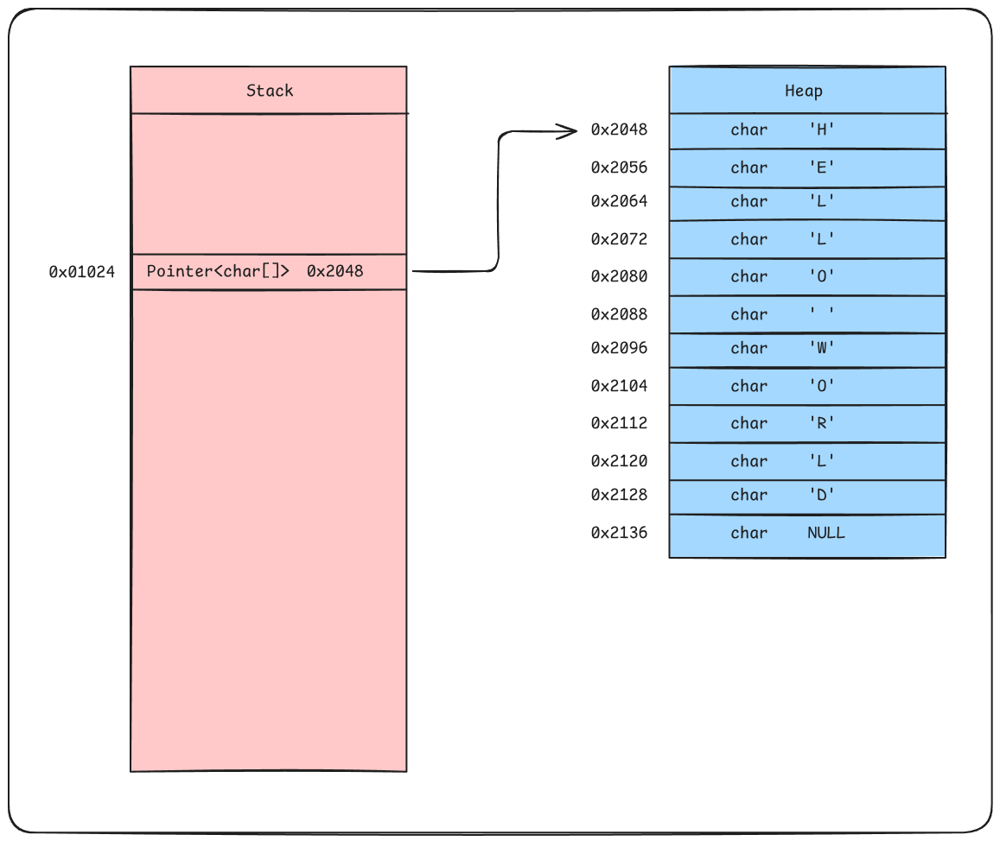

# Tipi

I `tipi` hanno lo scopo di **non far sbagliare il programmatore** e far **allocare il giusto 
numero di risorse** al **compilatore** o **interprete**.

Infatti, soprattutto se il programma è compilato, una volta che avrete il binario (il file 
che è effettivamente eseguibile dal vostro computer), non sarà più possibile distinguere i 
tipi.

> [!CAUTION]
> Questo concetto non è necessariamente vero ovunque e dipende dal tipo di linguaggio, 
> tuttavia, `C` e `C++` perdono la rappresentazione interna dei tipi, dopo la compilazione, 
> trattando i `bytes` in quanto `bytes`, lasciando la loro interpretazione alle funzioni che
> li usano.
>
> In caso la struttura interna dei tipi fosse ancora disponibile, sarebbe possibile il 
> concetto di [`Reflection`](https://it.wikipedia.org/wiki/Riflessione_(informatica))

## Considerazioni Iniziali

I vari linguaggi di programmazione si possono distinguere in **fortemente tipizzati** e
**debolmente tipizzati**, anche se questa è solo un'approssimazione e dipende da linguaggio 
a linguaggio.

In generale, i linguaggi **fortemente tipizzati** sono quelli compilati, o *"meta-compilati"*
(cioè che vengono prima trasformati in `bytecode` e poi eseguiti), mentre quelli 
**debolmente tipizzati** sono solitamente interpretati.

In generale, come detto sopra, la tipizzazione aiuta molto i programmatori ad evitare di fare
errori di logica e aiutano ad avere disponibili i suggerimenti per il metodo, funzione o 
oggetto che si sta usando. Pertanto, doveste usare un linguaggio **debolmente tipizzato** è 
sempre consigliabile usare i tipi se possibile, in modo da avere i suggerimenti e errori 
visibili fin da subito.

```bash
# Linguaggi fortemente tipizzati
# c, c++, swift, rust, zig, c#, java, typescript

# Linguaggi debolmente tipizzati
# python, javascript
```

## Value Types

> [!CAUTION]
> Il tipo `void` come tipo di ritorno di una funzione, indica che la funzione non ritorna
> nulla, neanche `null`. Invece, il puntatore a `void`, `void*`, indica che il tipo della
> variabile non è specificato, un po' come se fosse un `any`

I `Value Types` sono dei valori che vengono copiati così come sono. Questo significa che la
zona di memoria assegnata, solitamente lo `Stack`, viene copiata per intero ogni volta che 
passate la variabile come assegnazione o come argomento di una funzione.

Solitamente i `Value Types` sono i tipi di base o le `Struct`, se disponibili nel 
linguaggio di programmazione. Ogni qual volta che viene fatta l'assegnazione, il valore della
variabile viene copiato, quindi se ne modifichiamo uno, non tocchiamo l'altro. Tra i vari
tipi troviamo:

- `char`: singolo carattere `ASCII`, conosciuto anche come `byte` e `uint8` essendo contenuto 
    in `8 bit`
- `uint[8|16|32|64]`: intero senza segno contenuto in `n bit`, senza il numero prende la 
    dimensione dell'architettura
- `int[8|16|32|64]`: intero con segno contenuto in `n bit`, senza il numero prende la 
    dimensione dell'architettura
- `half`: numero a virgola mobile a mezza precisione. contenuto in `16 bit` o `2 B`
- `float`: numero a virgola mobile a singola precisione, contenuto in `32 bit` o `4 B`
- `double`: numero a virgola mobile a doppia precisione, contenuto in `64 bit` o `8 B`
- `boolean`: valore booleano, ovvero `True` or `False`, anche se teoricamente è `1 bit`, 
    solitamente è contenuto in `8 bit` per questioni di allineamento della `RAM`
- `pointer`: puntatore, indirizzo di memoria, la sua dimensione dipende dall'architettura, 
    `32 bit` o `64 bit`

```python
a : int = 0
b : int = a

b += 1

print(a)    # prints "0"
print(b)    # prints "1"
```

## Reference Types

> [!NOTE]
> Ma quindi, le `String` sono `Reference Type` o `Value Type`?
>
> Dipende dal linguaggio. In alcuni sono degli oggetti e in quanto tali, sono `reference`, 
> mentre in altri, come `Python`, si comportano esattamente come un `value type`.

I `Reference Types` sono dei tipi che vengono copiati per riferimento, ovvero passiamo solo
l'indirizzo in cui sono contenuti, di fatto avendo un solo valore e tanti riferimenti. 
Solitamente sono le `class` nei linguaggi e le variabili, istanze, prendono il nome di 
`oggetti`

Il motivo per cui si passa un riferimento, `puntatore`, è perché questi dati o sono troppo 
lunghi, quindi copiarli farebbe perdere troppo tempo, oppure la loro dimensione non è nota 
a priori e quindi bisogna vedere la dimensione durante il `runtime`. I `Reference Types` sono
solitamente allocati nell'`Heap`, mentre il `puntatore` nello `Stack`.



Quando *"copiamo"* o passiamo un `Reference Type` ad una funzione, in realtà stiamo copiando
solo il puntatore, se il linguaggio lo permette[^rust-borrow-checker], e quindi ogni variabile
in realtà contiene il puntatore alla zona di memoria.

Siccome operiamo su qualcosa che è contenuto in un'altra zona di memoria, accessibile da tutto
il programma, una volta che operiamo li, abbiamo cambiato il valore a tutte le variabili.

```python
a : list[int] = []
b: list[int] = a

b.append(1)

print(a)    # prints "[1]"
print(b)    # prints "[1]"
```

Come esercizio, in `Python`, provate a passare un `array` vuoto ad una funzione senza 
`return`, aggiungetegli un elemento e stampatelo fuori dalla funzione.

Come secondo esercizio, in `Python`, provate a passare un `array` vuoto ad una funzione senza
`return`, riassegnate il parametro formale con un nuovo `array` vuoto e aggiungetegli un 
elemento. Poi stampate la variabile che avete passato alla funzione.

## Riferimenti

- <https://en.wikipedia.org/wiki/Void_type>
- <https://doc.rust-lang.org/1.8.0/book/references-and-borrowing.html>
- <https://www.swift.org/documentation/articles/value-and-reference-types.html>

[^rust-borrow-checker]: In `Rust` è più complesso copiare un oggetto in quanto esiste il [Borrow Checker](https://doc.rust-lang.org/1.8.0/book/references-and-borrowing.html)

